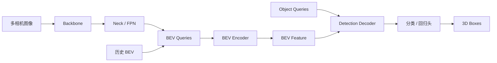
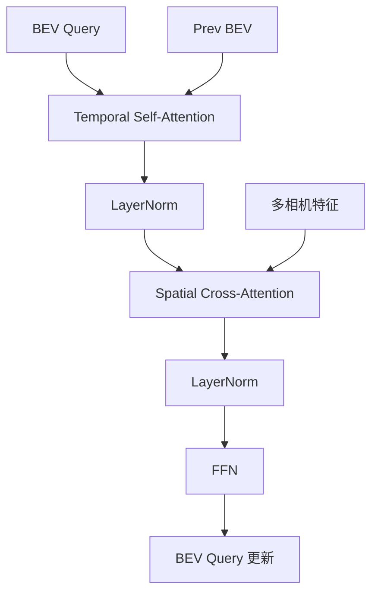

# BEVFormer 学习教程

基于你已经熟悉的 `Transformer encoder-decoder` 基础，这篇教程专门帮助你从 `Transformer_Toy` 过渡到 `BEVFormer`，并且结合两份真实代码来学：

- 公版实现：`/mnt/data/home/zw/src/BEVFormer`
- 地平线实现：`/mnt/data/home/zw/src/bev`
- 地平线训练框架源码：`/mnt/data/home/zw/oe/horizon_torch_samples-3.1.8-py3-none-any/hat`

这篇文档不只讲论文，还会回答你最关心的 4 件事：

1. 公版 `BEVFormer` 是怎么实现的
2. 地平线 `bev` 版本是怎么改的
3. 两个版本到底差在哪
4. 这些差异对量化、GPU 优化、BPU 部署有什么影响

---

## 1. 先用一句话理解 BEVFormer

`BEVFormer` 的本质是：

**把多相机图像特征，通过时空 Transformer 聚合到一个固定的 BEV 网格上，再在这个 BEV 空间里做 3D 感知。**

如果把普通 Transformer 看成：

```text
token -> token
```

那么 BEVFormer 更像：

```text
BEV query -> 去多相机图像上找信息 -> 和历史帧 BEV 融合 -> 得到当前时刻 BEV 表示
```

你可以把它理解成“给每个 BEV 网格格子一个 query，让它去所有相机里找和自己对应的视觉证据”。

---

## 2. 从 Transformer 视角看，BEVFormer 多了什么

你已经熟悉标准 `encoder-decoder`，那么 BEVFormer 可以这样类比：

- 标准 Transformer Encoder：
  - token 对 token 做 self-attention
- BEVFormer Encoder：
  - `BEV query` 先和历史 `BEV` 做 `Temporal Self-Attention`
  - 再和多相机图像特征做 `Spatial Cross-Attention`
- 标准 Transformer Decoder：
  - object query 对 memory 做 cross-attention
- BEVFormer Decoder：
  - `3D object query` 对 BEV feature 做 deformable cross-attention，输出 3D box

所以它仍然是 Transformer 思路，但“序列 token”被替换成了：

- `BEV 网格 query`
- `多相机图像特征`
- `3D 检测 query`

---

## 3. BEVFormer 整体数据流

### 图 1：从多相机到 3D 检测



### 图 2：BEV Encoder 的核心



这和你熟悉的 Transformer layer 非常像，只是：

- 第一个注意力不是普通 self-attention，而是“当前 BEV 和历史 BEV 的时序融合”
- 第二个注意力不是文本 cross-attention，而是“BEV 到多相机图像”的空间交叉注意力

---

## 4. 公版 BEVFormer 代码怎么读

公版代码主目录：

- 核心配置：`/mnt/data/home/zw/src/BEVFormer/projects/configs/bevformer/bevformer_tiny.py`
- detector：`/mnt/data/home/zw/src/BEVFormer/projects/mmdet3d_plugin/bevformer/detectors/bevformer.py`
- head：`/mnt/data/home/zw/src/BEVFormer/projects/mmdet3d_plugin/bevformer/dense_heads/bevformer_head.py`
- transformer：`/mnt/data/home/zw/src/BEVFormer/projects/mmdet3d_plugin/bevformer/modules/transformer.py`
- encoder：`/mnt/data/home/zw/src/BEVFormer/projects/mmdet3d_plugin/bevformer/modules/encoder.py`
- temporal attention：`/mnt/data/home/zw/src/BEVFormer/projects/mmdet3d_plugin/bevformer/modules/temporal_self_attention.py`
- spatial attention：`/mnt/data/home/zw/src/BEVFormer/projects/mmdet3d_plugin/bevformer/modules/spatial_cross_attention.py`
- decoder：`/mnt/data/home/zw/src/BEVFormer/projects/mmdet3d_plugin/bevformer/modules/decoder.py`

### 4.1 配置层面：公版 tiny 是什么结构

`bevformer_tiny.py` 给了一个很清晰的骨架：

- backbone：`ResNet50`
- neck：`FPN`
- BEV 尺寸：`50 x 50`
- encoder 层数：`3`
- decoder 层数：`6`
- query 数：`900`
- `queue_length = 3`
- 输入是 `nuScenes` 多相机序列

也就是说，公版 tiny 已经是一个“缩小版”的 BEVFormer：

- 用单尺度特征
- 用更小 BEV 网格
- 用更短时序队列

这对于学习代码很友好。

### 4.2 detector：负责组织训练和测试流程

`detectors/bevformer.py` 主要做 4 件事：

1. 提取多相机图像特征
2. 训练时先迭代历史帧，得到 `prev_bev`
3. 当前帧再走 `pts_bbox_head`
4. 测试时维护 `prev_frame_info`，实现流式推理

最重要的点是：

- 训练时会把一段序列拆成“历史帧 + 当前帧”
- 历史帧通过 `obtain_history_bev()` 逐步滚动出 `prev_bev`
- 当前帧利用 `prev_bev` 做时序融合

这其实就是 BEVFormer 的“时序记忆”机制。

### 4.3 head：把 BEV 特征变成 3D 检测结果

`dense_heads/bevformer_head.py` 里：

- `bev_embedding` 代表固定的 BEV query 网格
- `query_embedding` 代表 3D object queries
- `transformer(...)` 先产出 `bev_embed`，再产出 decoder 输出
- 最后通过分类分支和回归分支得到 3D box

这里的流程和 DETR 很接近：

```text
object query -> decoder -> cls/reg branches -> box
```

只是 memory 不再是 encoder token，而是 `BEV feature`。

### 4.4 PerceptionTransformer：公版的核心调度器

`modules/transformer.py` 中的 `PerceptionTransformer` 可以看成公版的“总控模块”。

它做了两类关键工作：

1. 生成 BEV feature
2. 用 detection decoder 从 BEV feature 中解码 3D 目标

`get_bev_features()` 里最关键的事情有：

- 根据 `can_bus` 计算 ego motion 引起的平移 `shift`
- 对 `prev_bev` 做旋转补偿
- 把 `cams_embeds` 和 `level_embeds` 加到图像特征上
- 调用 `encoder(...)` 做时空融合

这说明公版时序对齐的核心依赖：

- `can_bus` 的平移量
- 历史 BEV 的旋转补偿

这是一种比较“论文风格”的实现：几何逻辑很直接，依赖元信息较多。

### 4.5 公版 Encoder：先时序，再跨视角

`modules/encoder.py` 的 `BEVFormerEncoder` 做两件关键事：

1. 生成参考点
2. 调每层 `BEVFormerLayer`

这里有两种参考点：

- `ref_2d`：BEV 平面上的 2D 点，给 `TemporalSelfAttention`
- `ref_3d`：BEV pillar 中采样的 3D 点，给 `SpatialCrossAttention`

再通过 `point_sampling()`：

- 把 3D BEV 参考点投影到每个相机
- 得到 `reference_points_cam`
- 同时得到 `bev_mask`

这个 `bev_mask` 很重要，它告诉模型：

**某个 BEV query 在哪些相机里是可见的。**

### 4.6 公版 Temporal Self-Attention

`modules/temporal_self_attention.py` 的本质是：

- 把当前 query 和历史 BEV 拼起来
- 预测 deformable sampling offsets 和 attention weights
- 在“当前 + 历史”的 BEV 上取样并聚合

你可以把它理解成：

```text
当前 BEV query
    去历史 BEV 上找对应位置
    再把历史信息和当前信息融合
```

它并不是文本里的标准 self-attention 矩阵乘法，而是：

- 用 `deformable attention` 的 sparse 采样方式
- 在 BEV 网格上做时序信息聚合

#### 4.6.1 Temporal Self-Attention 逐步拆解

如果只看“一个 BEV 格子”发生了什么，可以把它拆成下面 5 步：

1. 当前帧的这个 `BEV query` 先拿到自己在 BEV 平面上的中心点 `ref_2d`
2. 如果有 `prev_bev`，就根据 ego motion 计算一个 `shift`，把历史帧参考点平移到当前坐标系
3. 用“历史 BEV 特征 + 当前 query 特征”一起预测：
   - `sampling_offsets`
   - `attention_weights`
4. 在参考点附近的少量位置做稀疏采样
5. 把“历史采样结果”和“当前采样结果”融合，写回当前这个 BEV 格子

可以把它想成：

```text
当前 BEV 格子 q
    -> 我上一帧对应的位置大概在哪里？
    -> 在那个位置附近采几个点看看
    -> 再和当前自己的局部信息融合
    -> 得到更新后的 q
```

这里最容易误解的一点是：

**它不是所有 BEV 格子两两计算相似度，而是每个格子只在参考点附近采少量点。**

也就是说，公版 `TemporalSelfAttention` 更接近：

```text
deformable self-attention on BEV
```

而不是：

```text
dense self-attention on all BEV tokens
```

#### 4.6.2 `ref_2d`、`sampling_offsets`、`attention_weights` 分别是什么

- `ref_2d`
  - 每个 BEV 格子在 BEV 平面上的归一化中心点
  - 它告诉 attention：“默认应该从哪里开始找”
- `sampling_offsets`
  - 网络预测出来的偏移量
  - 它告诉 attention：“不要只看中心点，再去附近几个位置也看看”
- `attention_weights`
  - 对这些采样点的加权系数
  - 它告诉 attention：“哪些采样点更重要”

所以在 TSA 里，真正发生的事情不是：

```text
QK^T -> softmax -> 加权 V
```

而更像：

```text
参考点 ref_2d
    + 学出来的 offsets
    -> 得到一组 sampling locations
    -> 在历史/当前 BEV 特征图上取值
    -> 用 attention weights 加权求和
```

#### 4.6.3 为什么它能做“时序对齐”

因为当前帧和历史帧之间，车本身可能已经运动了。

如果不做补偿，那么“上一帧同一个世界位置”在当前 BEV 网格里不一定还是同一个格子。

BEVFormer 的做法是：

- 用 `can_bus` 等元信息估计自车运动
- 对历史 `prev_bev` 做旋转/平移补偿
- 再让当前 query 去补偿后的历史位置附近采样

所以 TSA 的核心不是“记忆上一帧全部内容”，而是：

**让当前 BEV 格子去历史 BEV 里找和自己最相关的局部证据。**

### 4.7 公版 Spatial Cross-Attention

`modules/spatial_cross_attention.py` 是论文里最有代表性的部分之一。

逻辑可以压缩成：

1. 根据 `bev_mask` 找出每个相机真正需要处理的 BEV query
2. 把这些 query 按相机重排
3. 对每个相机执行 `MSDeformableAttention3D`
4. 把各相机结果再聚合回原始 BEV 网格

这是一种典型的“节省 GPU 显存”的稀疏处理策略：

- 不是让每个 BEV query 都看所有相机全部像素
- 而是先用几何投影筛出可能可见的部分

#### 4.7.1 Spatial Cross-Attention 先解决的根本问题

空间交叉注意力本质上在回答：

**“BEV 上这个格子，在真实 3D 空间对应的位置，投到各相机图像上以后，哪些位置能提供视觉证据？”**

这和 NLP 里的 cross-attention 很不一样。

NLP 里的 cross-attention 更像：

```text
decoder query -> 去整段 encoder memory 里匹配相关 token
```

而 BEVFormer 的 spatial cross-attention 更像：

```text
BEV query -> 先通过几何投影确定图像上的候选区域 -> 再在这些区域附近稀疏采样
```

#### 4.7.2 一个 BEV 格子如何去多相机上找信息

对单个 `BEV query` 来说，可以按下面顺序理解：

1. 它先在 BEV 空间里对应一个 `(x, y)` 网格位置
2. 为了表达高度信息，模型不会只取一个 3D 点，而是在这个 `(x, y)` 上沿高度方向采多个点，形成一个 BEV pillar
3. 这些 3D 点通过 `lidar2img` 分别投到每个相机平面上
4. 如果某个点投影后落在图像范围外，或者在相机后方，就通过 `bev_mask` 过滤掉
5. 对于仍然可见的相机，模型再围绕这些投影点做 deformable sampling
6. 最后把各相机采样得到的结果聚合回这个 BEV 格子

用一句更直白的话说：

**不是“这个格子去看整张图”，而是“这个格子先算出自己应该看图里的哪里，然后只看那附近几个点”。**

#### 4.7.3 为什么需要 `ref_3d` 而不是只用一个 2D 投影点

因为一个 BEV 格子只表示地面上的 `(x, y)` 位置，但真实世界中的物体有高度。

例如同一个 BEV 格子里可能出现：

- 地面
- 车辆底盘
- 车辆车顶
- 行人上半身

如果只投一个 2D 点，模型很难稳定地从图像里找到这些不同高度上的视觉证据。

所以 BEVFormer 会在 pillar 里采多个高度点，再分别投影到图像平面。

这样一个格子对应的就不是：

```text
1 个 3D 点 -> 1 个图像位置
```

而是：

```text
多个 3D 高度点 -> 多个图像参考位置 -> 每个参考位置附近再采样
```

这就是 `MSDeformableAttention3D` 名字里 `3D` 的关键来源。

#### 4.7.4 `bev_mask` 到底有什么用

`bev_mask` 可以理解成“可见性开关”。

它告诉模型：

- 这个 BEV 格子在某个相机里是否可见
- 如果不可见，就不要让它和这个相机的特征发生 attention

这样做有两个好处：

1. 节省显存和计算量
2. 避免让 query 去无意义的图像区域里胡乱匹配

所以 `bev_mask` 不是一个可有可无的小细节，而是整个 `SpatialCrossAttention` 能成立的重要前提。

#### 4.7.5 `MSDeformableAttention3D` 真正做了什么

在每个可见相机上，`MSDeformableAttention3D` 还是沿用 deformable attention 的套路：

1. 输入当前 `query`
2. 预测 `sampling_offsets`
3. 预测 `attention_weights`
4. 以投影得到的 `reference_points_cam` 为中心，在图像特征图上采样
5. 对采样结果加权求和

所以你可以把它概括成：

```text
query 决定“看哪里”和“怎么看”
reference point 决定“默认中心”
offset 决定“往中心周围偏多少”
weight 决定“每个采样点占多大比重”
```

#### 4.7.6 用伪代码串起来看一遍

下面这个伪代码不对应源码逐行实现，但和 BEVFormer 的真实逻辑是一一对应的：

```python
for bev_query in bev_queries:
    pillar_points_3d = sample_points_along_height(bev_query)

    evidence_from_cams = []
    for cam in cameras:
        proj_points = project_to_image(pillar_points_3d, cam)
        visible_points = filter_by_bev_mask(proj_points, cam)
        if not visible_points:
            continue

        offsets = predict_offsets(bev_query)
        weights = predict_attention_weights(bev_query)
        sampled_feats = sample_around_reference_points(
            image_feature_of(cam),
            visible_points,
            offsets,
        )
        cam_feat = weighted_sum(sampled_feats, weights)
        evidence_from_cams.append(cam_feat)

    bev_query = aggregate_across_cameras(evidence_from_cams)
```

你把这段伪代码和前面的 `TemporalSelfAttention` 对比一下，会发现它们其实是同一套思想：

- 都不是全连接 attention
- 都先给一个参考点
- 都学习 offset 和 weight
- 都只在少量位置做稀疏采样

差别只在于：

- TSA 是在 `BEV -> BEV`
- SCA 是在 `BEV -> multi-camera image`

#### 4.7.7 一张脑中应该有的图

理解到这里时，你脑子里最好形成下面这张“抽象图”：

```text
BEV query
    -> 在 BEV 平面有一个中心
    -> 沿高度方向展开成一个 3D pillar
    -> pillar 上多个点投影到各相机
    -> 用 bev_mask 去掉不可见相机
    -> 在剩余可见相机的投影附近做 deformable sampling
    -> 把多相机证据聚合回这个 BEV query
```

如果这张图你已经能稳定复述出来，那么 BEVFormer 的空间 attention 就算真正入门了。

### 4.8 公版 Detection Decoder

`modules/decoder.py` 的 `DetectionTransformerDecoder` 基本继承了 DETR3D 风格：

- query 先更新
- 每层用回归分支更新 `reference_points`
- 层层 refine 3D box

这部分和你熟悉的 Transformer decoder 非常接近，只是 cross-attention 用的是 deformable attention。

---

## 5. 地平线版本代码怎么读

地平线相关代码分成两层：

- 业务配置与任务组织：`/mnt/data/home/zw/src/bev`
- 通用训练框架与模块实现：`/mnt/data/home/zw/oe/horizon_torch_samples-3.1.8-py3-none-any/hat`

建议你把它看成：

```text
bev/
  是“项目配置 + 训练脚本 + 数据定义 + 部署入口”

hat/
  是“通用模型库 + 量化工具链 + 编译工具链”
```

### 5.1 地平线主配置

你现在主要在看：

- `bevformer_tiny_resnet50_detection_from_pilot_original.py`
- `bevformer_tiny_resnet50_detection_from_pilot.py`

其中当前 `pilot.py` 相比 `original.py`，一个很明显的变化是：

- `bev_decoders` 从 1 个扩展成了 2 个
- 也就是做成了 `multi-task` 风格

从配置可读出它和公版已经有明显差异：

- backbone：仍然是 `ResNet50`
- neck：仍然是 `FPN`
- BEV 尺寸：`100 x 100`
- `queue_length = 1`
- camera 数：`7`
- `single_bev = True`
- 使用 `ego2img` / 标定 YAML
- attention 模块被替换成 `Horizon*` 版本
- 增加了 `deploy_model`、`compile_cfg`、`onnx_cfg`
- 内建 calibration、QAT、quantize、HBIR/HBM 导出链路

这说明地平线版不是简单“复现公版”，而是：

**在保留 BEVFormer 思想的前提下，重写成适配量化与 BPU 编译的工程实现。**

### 5.2 地平线 detector：更模块化，也更工程化

`hat/models/structures/detectors/bevformer.py` 中的 `BevFormer` 比公版简单很多：

- `extract_feat()`
- `view_transformer()`
- 遍历 `bev_decoders`

它不像 MMDetection3D 风格那样把训练/测试逻辑深度耦合在 detector 中，而是更偏“模块组合器”。

同时它原生支持：

- `fuse_model()`
- `set_qconfig()`
- `export_reference_points()`

这三个接口非常关键，因为它们直接暴露给后续量化与部署流水线。

### 5.3 地平线 ViewTransformer：取代公版 PerceptionTransformer

地平线没有直接复用公版 `PerceptionTransformer`，而是用：

- `hat/models/task_modules/bevformer/view_transformer.py`
- 类名：`BevFormerViewTransformer`

它其实承担了“公版 transformer + 时序对齐 + 几何预处理 + 部署输入整理”的综合角色。

可以把它看成：

```text
公版 PerceptionTransformer
        +
公版 encoder 的部分前处理
        +
部署前的参考点导出逻辑
```

它新增了很多明显偏部署的东西：

- 多个 `QuantStub`
- `DeQuantStub`
- `is_compile`
- `get_reference_points_cam()`
- `get_deploy_prev()`
- `get_deploy_feats()`
- `export_bev_transform_points()`

这说明地平线版从设计开始就在考虑：

- 哪些张量要量化
- 哪些中间结果要单独导出
- 编译态输入必须固定成什么格式

### 5.4 地平线时序对齐：从 can_bus 旋转平移，改成显式 BEV warp

公版中，时序对齐核心是：

- `can_bus` 位姿差
- `rotate_prev_bev`
- `shift`

地平线版则改成：

- 通过 `ego2global` 计算当前帧与前一帧的变换
- 用 `export_bev_transform_points()` 生成 `norm_coords`
- 对 `prev_bev` 做 `grid_sample` 重采样

也就是说，地平线版的时序对齐更像：

```text
先显式生成 BEV warp grid
再把 prev_bev 直接重采样到当前坐标系
```

这个改法非常关键，因为：

- `grid_sample` 更容易被量化/编译链识别
- 计算图更静态
- 对部署更友好

代价是：

- 实现不再和论文公式一一对应
- 更依赖固定输入尺寸和预定义网格

### 5.5 地平线 Encoder：保留结构，重写算子

`hat/models/task_modules/bevformer/encoder.py` 可以看出，地平线版仍然保留了经典顺序：

```text
Temporal Self-Attention -> Norm -> Spatial Cross-Attention -> Norm -> FFN -> Norm
```

所以从“网络结构思想”看，它还是 BEVFormer。

但它和公版最大的不同不是层次结构，而是：

**attention 的内部算子被彻底重写了。**

### 5.6 地平线 Attention：为什么必须重写

地平线版注意力都在：

- `hat/models/task_modules/bevformer/attention.py`

关键类有：

- `HorizonTemporalSelfAttention`
- `HorizonSpatialCrossAttention`
- `HorizonMultiScaleDeformableAttention3D`
- `HorizonMultiScaleDeformableAttention`

它们与公版最大不同在于：

1. 量化意识很强
2. 部署形态很强
3. 避免直接依赖 MMCV CUDA 自定义算子

#### 5.6.1 TemporalSelfAttention 的改法

公版里 temporal attention 主要依赖 deformable attention 的 CUDA/torch 实现。

地平线版里你会看到很多新增组件：

- `QuantStub`
- `FloatFunctional`
- `query_reduce_mean` 的 `Conv2d`
- `fix_weight_qscale()`
- `switch_to_deploy()`

这里最值得注意的是：

- 它把“历史帧 + 当前帧”的融合，做成了更适合量化的卷积/逐元素/固定 reshape 组合
- 还专门提供 `fix_weight_qscale()` 修正量化比例
- `switch_to_deploy()` 会把 offset 参数按 feature map 尺寸归一化，变成编译态更稳定的形式

这已经不只是“实现等价”，而是“为了量化和部署重新参数化”。

#### 5.6.2 SpatialCrossAttention 的改法

公版空间交叉注意力的主思路是：

- 根据可见性把 query 稀疏重排
- 每个相机做 deformable attention
- 再 scatter 回 BEV

地平线版保留了“稀疏重排”思想，但实现方式明显换成了：

- `grid_sample`
- 固定 shape 的 `queries_rebatch_grid`
- `restore_bev_grid`
- `query_reduce_sum` 分组卷积
- `bev_pillar_counts` 归一化

也就是说，它把“索引式 gather/scatter”尽量改写成了：

**规则网格采样 + 卷积归约**

这对 BPU 很重要，因为：

- 规则算子更容易编译
- 静态 shape 更容易优化
- 量化路径更可控

### 5.7 地平线 Decoder：保留 DETR 逻辑，但加入编译分支

`hat/models/task_modules/bevformer/decoder.py` 的 `BEVFormerDetDecoder` 和公版思路非常像：

- 有 `query_embedding`
- 有 `reference_points`
- 每层 decoder 后都有 cls/reg 分支
- `get_outputs()` 中把归一化坐标还原到物理坐标

但它多了两个工程化特征：

1. `is_compile`
2. `set_qconfig()`

其中 `is_compile=True` 时，decoder 不再输出完整训练态结构，而是只吐出部署真正需要的几个张量：

- `bev_embed`
- 最后一层 `outputs_classes`
- 最后一层 `reference_out`
- 最后一层 `outputs_coords`

这说明地平线版训练态和部署态是显式分离的。

---

## 6. 公版与地平线版，到底有哪些核心区别

下面只抓最重要、最影响理解和部署的差异。

### 6.1 差异一：框架范式不同

公版：

- 基于 `MMDetection3D + MMCV`
- detector/head/transformer 高度贴近学术代码组织方式
- 更强调论文复现与 GPU 训练

地平线版：

- 基于 `hat` 训练框架
- 模块统一注册到 `OBJECT_REGISTRY`
- 模型从一开始就暴露量化、融合、编译接口
- 更强调工程部署闭环

一句话概括：

**公版更像研究代码，地平线版更像部署代码。**

### 6.2 差异二：时序对齐方式不同

公版：

- 基于 `can_bus`
- 对 `prev_bev` 旋转
- 用 `shift` 修正参考点

地平线版：

- 基于 `ego2global`
- 直接生成 BEV warp grid
- 用 `grid_sample` 对 `prev_bev` 做空间重采样

影响：

- 公版更贴近论文直觉
- 地平线版更贴近硬件可执行图

### 6.3 差异三：空间交叉注意力的算子实现不同

公版：

- 依赖 `MSDeformableAttention3D`
- 用自定义 CUDA / MMCV deformable attention
- GPU 上效率高，学术社区通用

地平线版：

- 重写成 `HorizonMultiScaleDeformableAttention3D`
- 大量引入 `grid_sample`、`FloatFunctional`、卷积归约
- 强调静态 shape、量化友好和编译友好

影响：

- GPU 学术训练上，公版更自然
- BPU 部署上，地平线版更自然

### 6.4 差异四：模型结构规模和任务设置不同

公版 tiny：

- `bev_h = 50`
- `bev_w = 50`
- `queue_length = 3`
- 典型 `nuScenes` 相机设定
- 单个检测 head

地平线当前版本：

- `bev_h = 100`
- `bev_w = 100`
- `queue_length = 1`
- `numcam = 7`
- 使用 `Seg2BevSequenceDataset`
- 当前 `pilot.py` 是双 decoder 的 multi-task 形式

影响：

- 地平线版已经不是“公版 tiny 原样搬运”
- 它带了自己的数据定义、相机数、BEV 尺寸和任务拆分

### 6.5 差异五：训练态和部署态是否显式分离

公版：

- 主要围绕训练和 GPU 推理组织
- 没有天然的 BPU 编译图入口

地平线版：

- `model`
- `test_model`
- `deploy_model`
- `hbir_infer_model`

这些对象在配置里是明确区分的。

它还把部署流水线拆成：

- calibration
- QAT
- quantize
- HBIR export
- HBM compile

这说明地平线版不是“训练完再想部署”，而是“从配置层就把部署路径写死了”。

---

## 7. 地平线量化与部署链路是怎样工作的

这是地平线版本和公版最大的现实差异。

### 7.1 在 `bev` 配置里已经写好的流程

`bevformer_tiny_resnet50_detection_from_pilot.py` 中，你能直接看到以下阶段：

1. `float_trainer`
2. `calibration_trainer`
3. `qat_trainer`
4. `int_infer_trainer`
5. `hbir_infer_model`
6. `compile_cfg`
7. `onnx_cfg`

这已经构成完整闭环。

### 7.2 `hat` 里的三个关键 converter

在 `hat/models/model_convert/converters.py` 中：

- `Float2Calibration`
- `Float2QAT`
- `QAT2Quantize`

它们的职责分别是：

- `Float2Calibration`：把浮点模型转换成校准模型，收集激活统计
- `Float2QAT`：把浮点模型转换成 QAT 模型，插入 fake quant
- `QAT2Quantize`：把 QAT 模型真正转换成量化模型

### 7.3 `LoadCheckpoint` 的作用

`hat/models/model_convert/ckpt_converters.py` 里的 `LoadCheckpoint` 负责把 checkpoint 插进不同阶段。

这就是为什么你在配置里能看到类似这样的链：

```text
LoadCheckpoint -> RepModel2Deploy -> Float2Calibration -> FixWeightQScale
```

它说明：

- 不是单纯“load 一次权重”
- 而是在不同阶段载入不同状态的模型

### 7.4 HBIR 与 HBM

`hat/utils/hbdk4/hbir_exporter.py`：

- 把 QAT 模型导出成 `HBIR`
- 再 convert 成 quantized `HBIR`

`hat/utils/hbdk4/hbir_compiler.py`：

- 把 quantized HBIR 编译成 `HBM`

这是典型的地平线 BPU 部署链：

```text
PyTorch QAT model
    -> HBIR
    -> quantized HBIR
    -> HBM
    -> BPU 运行
```

---

## 8. 这些差异对量化有什么影响

这是你最关心的重点之一。

### 8.1 公版 BEVFormer 对量化并不友好

原因不是它不能量化，而是它的关键算子并不是为量化设计的：

- 依赖 `MMCV` 的 deformable attention 自定义实现
- 时序对齐逻辑偏动态
- 中间张量组织更偏研究代码
- 没有统一 `set_qconfig()` / `fuse_model()` 接口

如果你想在 NVIDIA GPU 上用 `ModelOpt` 一类工具做量化，通常只能优先覆盖这些部分：

- `ResNet50`
- `FPN`
- decoder / head 里的标准 `Linear`
- attention 内部能递归找到的标准 `Linear`

但真正关键的自定义注意力核本身，量化支持通常不完整。

### 8.2 地平线版从设计上就是量化友好版本

地平线版的很多改动，其实都能归结到一句话：

**把难量化、难编译的动态算子，改写成更规则的静态图。**

典型表现包括：

- 模块内部显式插入 `QuantStub`
- 用 `FloatFunctional` 管逐元素加法/乘法/拼接
- 用 `Conv2d` 做 reduce mean / reduce sum
- 用 `grid_sample` 替代更难编译的索引式操作
- 提供 `set_qconfig()`
- 提供 `fix_weight_qscale()`
- 提供 `switch_to_deploy()`

这意味着：

- 它不是“训练后再尝试量化”
- 而是“模型结构本身就是按照量化图来设计的”

### 8.3 哪些改动最直接提升量化可行性

最关键的有 4 个：

1. 显式量化节点管理  
   公版很多地方是普通 PyTorch 张量流，地平线版明确标出哪些中间量要 quant/dequant。

2. 静态 shape 化  
   `queries_rebatch_grid`、`restore_bev_grid`、`reference_points_rebatch` 这类张量在部署态是明确输入，减少动态图不确定性。

3. 算子改写  
   把复杂 scatter/gather 风格逻辑尽量改成 `grid_sample + conv + elementwise`。

4. 专门修正量化尺度  
   比如 `fix_weight_qscale()` 这类逻辑，在 attention 模块中很关键。

---

## 9. 这些差异对 GPU 优化有什么影响

### 9.1 对 NVIDIA GPU 训练/推理，公版通常更自然

原因是：

- 公版使用 `MMCV` / CUDA 优化过的 deformable attention
- 设计目标就是 GPU 训练
- 学术界验证多，基线更直接

所以如果你的目标是：

- 论文复现
- GPU 上继续做研究
- 跑出接近论文的训练结果

优先学习和实验公版更合适。

### 9.2 地平线版在 GPU 上可以跑，但它的优化目标不是 GPU 极致性能

地平线版当然可以在 GPU 上训练和校准，但它引入的许多设计其实是为 BPU 服务：

- 更多 shape 约束
- 更多量化桩
- 更多部署态特化分支
- 更多为了编译稳定性而做的结构改写

所以在纯 GPU 场景下，它未必比公版更快，甚至可能：

- 更难和通用 CUDA kernel 最优路径对齐
- 更偏“部署友好”而不是“GPU 极致吞吐友好”

### 9.3 对 GPU 量化优化的结论

如果目标平台是 `NVIDIA GPU`：

- 公版更适合做浮点训练与研究
- 想做量化时，优先量化 `backbone/neck/head`
- 对 attention 核心算子要单独评估是否能被 TensorRT / ModelOpt 真正吃下
- 地平线版可作为“量化结构改写思路”的参考，但不一定是 GPU 最优实现

---

## 10. 这些差异对 BPU 优化有什么影响

### 10.1 对地平线 BPU，公版几乎不是直接可部署形态

因为公版存在这些问题：

- 依赖 MMCV 自定义算子
- 图中动态逻辑较多
- 没有直接面向 BPU 的导出路径
- 没有 HBIR/HBM 编译链整合

即使理论上能改，也需要做大量重写。

### 10.2 地平线版就是面向 BPU 重构后的版本

地平线版已经把下面这些都补齐了：

- 量化配置接口
- calibration / QAT / quantize
- deploy model
- HBIR 导出
- HBM 编译
- 流式推理中的历史 BEV 输入整理

所以对 BPU 而言，地平线版的优势不是“小优化”，而是：

**从不可直接部署，变成可工程落地部署。**

### 10.3 对 BPU 模型优化的结论

如果目标平台是 `地平线 BPU`：

- 优先使用地平线版结构
- 尽量不要直接拿公版去硬套
- 公版更适合作为“算法参考”
- 地平线版更适合作为“部署基线”

---

## 11. 一个最实用的总对比表

| 维度 | 公版 `BEVFormer` | 地平线 `bev + hat` |
|------|------------------|--------------------|
| 主要目标 | 论文复现、GPU 训练 | 量化部署、BPU 落地 |
| 框架 | MMDetection3D / MMCV | HAT + Horizon Plugin |
| 时序对齐 | `can_bus` + rotate/shift | `ego2global` + `grid_sample` warp |
| 空间注意力 | MMCV deformable attention | Horizon 重写版 attention |
| 中间张量 | 更偏研究代码 | 明确服务部署输入 |
| 量化接口 | 不统一 | `set_qconfig()` / `fuse_model()` 完整 |
| 部署态分支 | 较弱 | `is_compile` / `deploy_model` 明确 |
| GPU 友好性 | 强 | 中等，更多为 BPU 妥协 |
| BPU 友好性 | 弱 | 很强 |
| 学习价值 | 适合理解原始 BEVFormer | 适合理解工业部署改写 |

---

## 12. 建议你怎么学这两份代码

如果你的目标是“先真正吃透 BEVFormer，再理解工业部署改写”，建议顺序如下：

### 第一阶段：先吃透公版主线

按这个顺序读：

1. `projects/configs/bevformer/bevformer_tiny.py`
2. `detectors/bevformer.py`
3. `dense_heads/bevformer_head.py`
4. `modules/transformer.py`
5. `modules/encoder.py`
6. `modules/temporal_self_attention.py`
7. `modules/spatial_cross_attention.py`
8. `modules/decoder.py`

目标是回答 3 个问题：

1. `prev_bev` 是怎么来的
2. `BEV query` 是怎么从多相机取信息的
3. `object query` 是怎么从 BEV 解码成 3D box 的

### 第二阶段：再读地平线 view transformer 和 attention

重点读：

1. `hat/models/structures/detectors/bevformer.py`
2. `hat/models/task_modules/bevformer/view_transformer.py`
3. `hat/models/task_modules/bevformer/encoder.py`
4. `hat/models/task_modules/bevformer/attention.py`
5. `hat/models/task_modules/bevformer/decoder.py`

目标是回答 3 个问题：

1. 公版的哪部分被改写进 `view_transformer`
2. 哪些 attention 逻辑是为量化/BPU 改的
3. 部署态输入为什么要拆成那么多 reference/grid 张量

### 第三阶段：最后看量化部署链

重点读：

1. `bevformer_tiny_resnet50_detection_from_pilot.py`
2. `hat/models/model_convert/converters.py`
3. `hat/models/model_convert/ckpt_converters.py`
4. `hat/utils/hbdk4/hbir_exporter.py`
5. `hat/utils/hbdk4/hbir_compiler.py`

目标是把下面这条链真正串起来：

```text
float
-> calibration
-> qat
-> quantize
-> hbir
-> hbm
-> bpu infer
```

---

## 13. 最后的结论

如果只用一句话总结这次对比：

**公版 BEVFormer 重点是“如何做 BEV 时空建模”，地平线版重点是“如何把这个建模改造成可量化、可编译、可部署到 BPU 的工程系统”。**

更具体地说：

- 公版回答的是“BEVFormer 算法是什么”
- 地平线版回答的是“BEVFormer 在工业部署里应该怎么重写”

对量化和模型优化的影响可以浓缩成：

- 在 `GPU` 上：
  - 公版更适合做研究和浮点训练
  - 量化通常只能优先覆盖标准 Conv/Linear
  - attention 自定义核仍是难点
- 在 `BPU` 上：
  - 地平线版明显更有优势
  - 因为它的 attention、时序对齐、deploy 输入、HBIR/HBM 链路都已经围绕 BPU 重构过

---

## 14. 你下一步最值得做的事

如果你要继续深入，最推荐这 3 个练习：

1. 手画一遍“公版 `PerceptionTransformer.get_bev_features()` 的数据流”
2. 手画一遍“地平线 `BevFormerViewTransformer.forward()` 的训练态和部署态分支”
3. 把公版 `SpatialCrossAttention` 和地平线 `HorizonSpatialCrossAttention` 并排对照，逐步对应“稀疏重排 -> attention -> 恢复 BEV”的每一步

做完这 3 件事，你基本就不只是“看过” BEVFormer，而是真的能把算法实现和部署实现对应起来。
